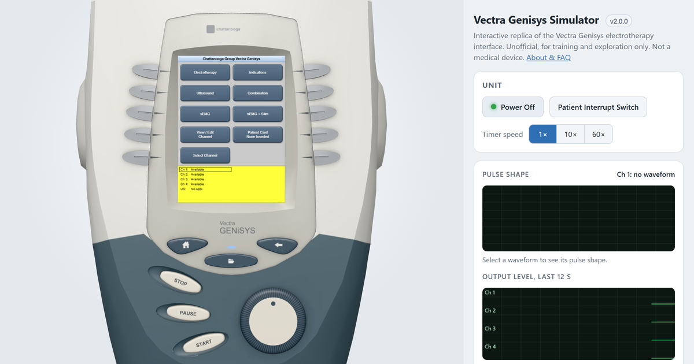

# Vectra Genisys Simulator

**[Try it at estim.builtbyzee.com →](https://estim.builtbyzee.com/)**

[](https://estim.builtbyzee.com/)

An interactive browser replica of the Chattanooga Vectra Genisys electrotherapy unit's interface. Practice treatment setup for all 10 electrotherapy waveforms, browse clinical protocols, and watch the simulated output, all without the hardware.

Unofficial, for training and exploration only. Not a medical device.

## Running locally

```sh
npm install
npm run dev    # http://localhost:5173
npm test
```

See [docs/device-reference.md](docs/device-reference.md) for how the simulation maps to the user manual.
